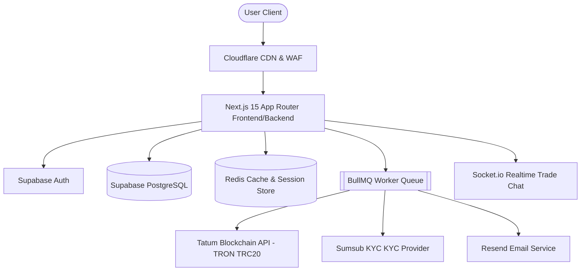

# Implementation Plan - Ethiopian P2P USDT Marketplace

The Ethiopian P2P USDT Marketplace is a high-throughput, secure, and compliance-first cryptocurrency exchange designed to facilitate peer-to-peer (P2P) trading of USDT (TRON TRC20) for Ethiopian Birr (ETB) through local payment methods.

---

## Architecture Overview

The system uses a modern, multi-tier architecture to guarantee security, fault tolerance, and high availability.



### Key Subsystems
1. **Authentication & Identity Platform**: Supabase Auth combined with custom TOTP 2FA, session profiling, device fingerprinting, and security audit logs.
2. **Escrow Wallet Core**: Manages TRON TRC20 deposits and withdrawals via Tatum API. Implements a double-entry balance ledger to guarantee funds consistency.
3. **P2P Matching and State Engine**: Handles advertisement listings, limits, order book matching, trade life cycles, and automated escrow locks.
4. **Real-Time Trade & Chat Rooms**: Provides peer-to-peer real-time communication, status synchronization, system instructions, and file evidence upload over Socket.io / Supabase Realtime.
5. **KYC & Compliance Gateway**: Standardized adapter interfaces integrating Sumsub for liveness, AML verification, and manual admin fallback approvals.
6. **Dispute & Governance Portal**: Enterprise dashboard for administrators to examine trade logs, view user chat, verify bank receipts, and execute manual escrow resolutions.

---

## User Review Required

> [!IMPORTANT]
> **Sumsub Sandbox Integration & API Keys**:
> Tatum API and Sumsub Sandbox credentials must be provided for staging verification. If they are not available, mock providers will be auto-generated in sandbox mode.
> 
> **Escrow Security**:
> All escrow operations interact with a multi-layered double-entry system in PostgreSQL. For maximum security, we propose keeping the platform's hot-wallet private keys managed purely in Tatum or AWS KMS.
>
> **Trade Dispute Mediation Rules**:
> Admin decisions to release/refund escrow are final and overwrite state engines. An automated lock system prevents simultaneous updates on a trade.

---

## Proposed Changes

### Component 1: Database Setup & Prisma ORM

#### [NEW] [schema.prisma](file:///c:/Users/User/Documents/babi/Hab2/prisma/schema.prisma)
Defines the complete Postgres relational model, complete with indexes, enums, constraints, and audit fields.

```prisma
datasource db {
  provider = "postgresql"
  url      = env("DATABASE_URL")
}

generator client {
  provider = "prisma-client-js"
}

enum KycStatus {
  PENDING
  REVIEWING
  APPROVED
  REJECTED
}

enum TradeType {
  BUY
  SELL
}

enum AdStatus {
  ACTIVE
  PAUSED
  CLOSED
}

enum TradeStatus {
  OPEN
  PAID
  RELEASED
  DISPUTED
  CANCELLED
}

enum TransactionType {
  DEPOSIT
  WITHDRAWAL
  ESCROW_LOCK
  ESCROW_RELEASE
  ESCROW_REFUND
}

enum TransactionStatus {
  PENDING
  COMPLETED
  FAILED
}

enum PaymentProvider {
  CBE
  DASHEN
  AWASH
  ABYSSINIA
  TELEBIRR
}

enum DisputeStatus {
  OPEN
  RESOLVED
  DISMISSED
}

enum NotificationType {
  SYSTEM
  TRADE
  WALLET
  KYC
  SECURITY
}

enum Severity {
  INFO
  WARNING
  CRITICAL
}

model Profile {
  id                  String             @id @default(uuid())
  email               String             @unique
  username            String             @unique
  kycStatus           KycStatus          @default(PENDING)
  kycVerifiedAt       DateTime?
  twoFactorEnabled    Boolean            @default(false)
  twoFactorSecret     String?
  withdrawalPinHash   String?
  referralCode        String?
  trustScore          Float              @default(100.0)
  completedTrades     Int                @default(0)
  totalTrades         Int                @default(0)
  positiveRatings     Int                @default(0)
  negativeRatings     Int                @default(0)
  averageReleaseTime  Float              @default(0.0) // In seconds
  createdAt           DateTime           @default(now())
  updatedAt           DateTime           @updatedAt
  deletedAt           DateTime?

  wallets             Wallet[]
  paymentMethods      PaymentMethod[]
  advertisements      Advertisement[]
  tradesAsBuyer       Trade[]            @relation("BuyerTrades")
  tradesAsSeller      Trade[]            @relation("SellerTrades")
  tradeMessages       TradeMessage[]
  tradeEvidence       TradeEvidence[]
  disputesInitiated   Dispute[]          @relation("InitiatedDisputes")
  kycVerifications    KycVerification[]
  notifications       Notification[]
  auditLogs           AuditLog[]
  adminActions        AdminAction[]      @relation("AdminActionUser")
  securityEvents      SecurityEvent[]
  sessions            Session[]

  @@index([email])
  @@index([username])
}

model Wallet {
  id                String             @id @default(uuid())
  profileId         String
  profile           Profile            @relation(fields: [profileId], references: [id], onDelete: Cascade)
  availableBalance  Decimal            @default(0.00) @db.Decimal(20, 8)
  frozenBalance     Decimal            @default(0.00) @db.Decimal(20, 8)
  escrowBalance     Decimal            @default(0.00) @db.Decimal(20, 8)
  totalBalance      Decimal            @default(0.00) @db.Decimal(20, 8)
  currency          String             @default("USDT")
  createdAt         DateTime           @default(now())
  updatedAt         DateTime           @updatedAt

  addresses         WalletAddress[]
  transactions      Transaction[]

  @@index([profileId])
}

model WalletAddress {
  id         String   @id @default(uuid())
  walletId   String
  wallet     Wallet   @relation(fields: [walletId], references: [id], onDelete: Cascade)
  chain      String   @default("TRON") // TRC20
  address    String   @unique
  memo       String?
  qrCodeUrl  String?
  createdAt  DateTime @default(now())
  updatedAt  DateTime @updatedAt

  @@index([walletId])
  @@index([address])
}

model Transaction {
  id             String            @id @default(uuid())
  walletId       String
  wallet         Wallet            @relation(fields: [walletId], references: [id], onDelete: Cascade)
  amount         Decimal           @db.Decimal(20, 8)
  type           TransactionType
  status         TransactionStatus @default(PENDING)
  txHash         String?           @unique
  fee            Decimal           @default(0.00) @db.Decimal(20, 8)
  confirmations  Int               @default(0)
  description    String?
  createdAt      DateTime          @default(now())
  updatedAt      DateTime          @updatedAt

  @@index([walletId])
  @@index([type])
  @@index([status])
}

model Deposit {
  id             String            @id @default(uuid())
  walletId       String
  amount         Decimal           @db.Decimal(20, 8)
  address        String
  txHash         String            @unique
  confirmations  Int               @default(0)
  status         TransactionStatus @default(PENDING)
  createdAt      DateTime          @default(now())
  updatedAt      DateTime          @updatedAt

  @@index([walletId])
  @@index([txHash])
}

model Withdrawal {
  id                 String            @id @default(uuid())
  walletId           String
  amount             Decimal           @db.Decimal(20, 8)
  destinationAddress String
  txHash             String?           @unique
  status             TradeStatus       @default(OPEN) // Managed state (PENDING, APPROVED, REJECTED, COMPLETED)
  approvedByAdminId  String?
  rejectedReason     String?
  createdAt          DateTime          @default(now())
  updatedAt          DateTime          @updatedAt

  @@index([walletId])
}

model PaymentMethod {
  id         String          @id @default(uuid())
  profileId  String
  profile    Profile         @relation(fields: [profileId], references: [id], onDelete: Cascade)
  provider   PaymentProvider
  details    Json            // e.g. { "accountName": "...", "accountNumber": "..." }
  status     Boolean         @default(true)
  createdAt  DateTime        @default(now())
  updatedAt  DateTime        @updatedAt

  @@index([profileId])
}

model Advertisement {
  id             String          @id @default(uuid())
  profileId      String
  profile        Profile         @relation(fields: [profileId], references: [id], onDelete: Cascade)
  tradeType      TradeType
  price          Decimal         @db.Decimal(20, 2) // Price in ETB per USDT
  amount         Decimal         @db.Decimal(20, 8)
  remainingAmount Decimal        @db.Decimal(20, 8)
  minOrder       Decimal         @db.Decimal(20, 2) // Min ETB per transaction
  maxOrder       Decimal         @db.Decimal(20, 2) // Max ETB per transaction
  paymentMethods Json            // Array of PaymentProvider
  terms          String?         @db.Text
  status         AdStatus        @default(ACTIVE)
  createdAt      DateTime        @default(now())
  updatedAt      DateTime        @updatedAt
  deletedAt      DateTime?

  trades         Trade[]

  @@index([profileId])
  @@index([tradeType])
  @@index([status])
}

model Trade {
  id               String        @id @default(uuid())
  adId             String
  advertisement    Advertisement @relation(fields: [adId], references: [id], onDelete: Cascade)
  buyerId          String
  buyer            Profile       @relation("BuyerTrades", fields: [buyerId], references: [id])
  sellerId         String
  seller           Profile       @relation("SellerTrades", fields: [sellerId], references: [id])
  amount           Decimal       @db.Decimal(20, 8) // USDT amount
  price            Decimal       @db.Decimal(20, 2) // ETB rate
  fiatAmount       Decimal       @db.Decimal(20, 2) // Total ETB
  escrowStatus     String        @default("LOCKED")
  status           TradeStatus   @default(OPEN)
  paymentMethodId  String
  paymentDetails   Json
  buyerPaidAt      DateTime?
  releasedAt       DateTime?
  disputedAt       DateTime?
  cancelledAt      DateTime?
  createdAt        DateTime      @default(now())
  updatedAt        DateTime      @updatedAt

  messages         TradeMessage[]
  evidence         TradeEvidence[]
  disputes         Dispute[]

  @@index([adId])
  @@index([buyerId])
  @@index([sellerId])
  @@index([status])
}

model TradeMessage {
  id        String   @id @default(uuid())
  tradeId   String
  trade     Trade    @relation(fields: [tradeId], references: [id], onDelete: Cascade)
  senderId  String?
  sender    Profile? @relation(fields: [senderId], references: [id])
  content   String   @db.Text
  isSystem  Boolean  @default(false)
  fileUrl   String?
  fileType  String?
  createdAt DateTime @default(now())

  @@index([tradeId])
}

model TradeEvidence {
  id          String   @id @default(uuid())
  tradeId     String
  trade       Trade    @relation(fields: [tradeId], references: [id], onDelete: Cascade)
  disputeId   String?
  dispute     Dispute? @relation(fields: [disputeId], references: [id])
  submitterId String
  submitter   Profile  @relation(fields: [submitterId], references: [id])
  fileUrl     String
  fileType    String
  description String?  @db.Text
  createdAt   DateTime @default(now())

  @@index([tradeId])
}

model Dispute {
  id                 String        @id @default(uuid())
  tradeId            String
  trade              Trade         @relation(fields: [tradeId], references: [id], onDelete: Cascade)
  initiatorId        String
  initiator          Profile       @relation("InitiatedDisputes", fields: [initiatorId], references: [id])
  reason             String
  description        String        @db.Text
  status             DisputeStatus @default(OPEN)
  resolutionNotes    String?       @db.Text
  resolvedByAdminId  String?
  resolvedAt         DateTime?
  createdAt          DateTime      @default(now())
  updatedAt          DateTime      @updatedAt

  evidence           TradeEvidence[]

  @@index([tradeId])
  @@index([status])
}

model KycVerification {
  id               String    @id @default(uuid())
  profileId        String
  profile          Profile   @relation(fields: [profileId], references: [id], onDelete: Cascade)
  provider         String    @default("SUMSUB")
  referenceId      String    @unique
  level            String    @default("DEFAULT")
  status           KycStatus @default(PENDING)
  rejectionReason  String?
  idFrontUrl       String?
  idBackUrl        String?
  selfieUrl        String?
  livenessData     Json?
  amlCleared       Boolean   @default(false)
  sanctionsCleared Boolean   @default(false)
  rawResponse      Json?
  createdAt        DateTime  @default(now())
  updatedAt        DateTime  @updatedAt

  @@index([profileId])
}

model Notification {
  id        String           @id @default(uuid())
  profileId String
  profile   Profile          @relation(fields: [profileId], references: [id], onDelete: Cascade)
  title     String
  content   String           @db.Text
  type      NotificationType @default(SYSTEM)
  read      Boolean          @default(false)
  link      String?
  createdAt DateTime         @default(now())

  @@index([profileId])
  @@index([read])
}

model AuditLog {
  id         String   @id @default(uuid())
  adminId    String?
  profile    Profile? @relation(fields: [adminId], references: [id])
  action     String
  entityType String
  entityId   String
  ipAddress  String?
  userAgent  String?
  details    Json?
  createdAt  DateTime @default(now())

  @@index([adminId])
}

model AdminAction {
  id           String   @id @default(uuid())
  adminId      String
  admin        Profile  @relation("AdminActionUser", fields: [adminId], references: [id], onDelete: Cascade)
  actionType   String
  details      Json?
  createdAt    DateTime @default(now())

  @@index([adminId])
}

model SecurityEvent {
  id                String    @id @default(uuid())
  profileId         String?
  profile           Profile?  @relation(fields: [profileId], references: [id])
  eventType         String
  severity          Severity  @default(INFO)
  ipAddress         String?
  userAgent         String?
  deviceFingerprint String?
  details           Json?
  createdAt         DateTime  @default(now())

  @@index([profileId])
  @@index([eventType])
}

model Session {
  id                String   @id @default(uuid())
  profileId         String
  profile           Profile  @relation(fields: [profileId], references: [id], onDelete: Cascade)
  token             String   @unique
  expiresAt         DateTime
  ipAddress         String?
  userAgent         String?
  deviceFingerprint String?
  isVerifiedDevice  Boolean  @default(true)
  isSuspicious      Boolean  @default(false)
  lastActiveAt      DateTime @default(now())
  createdAt         DateTime @default(now())

  @@index([profileId])
  @@index([token])
}
```

#### [NEW] [supabase_rls.sql](file:///c:/Users/User/Documents/babi/Hab2/supabase/supabase_rls.sql)
Raw SQL script setting up schemas, trigger actions to auto-create profiles on Supabase user registration, and enforcing Row-Level Security (RLS) policies.

```sql
-- Ensure profile creation trigger on signup
CREATE OR REPLACE FUNCTION public.handle_new_user()
RETURNS trigger AS $$
BEGIN
  INSERT INTO public."Profile" (id, email, username, "kycStatus", "trustScore", "createdAt", "updatedAt")
  VALUES (
    new.id,
    new.email,
    COALESCE(new.raw_user_meta_data->>'username', split_part(new.email, '@', 1)),
    'PENDING',
    100.0,
    now(),
    now()
  );
  
  -- Create matching Wallet
  INSERT INTO public."Wallet" (id, "profileId", "availableBalance", "frozenBalance", "escrowBalance", "totalBalance", "currency", "createdAt", "updatedAt")
  VALUES (
    gen_random_uuid(),
    new.id,
    0.00,
    0.00,
    0.00,
    0.00,
    'USDT',
    now(),
    now()
  );
  
  RETURN new;
END;
$$ LANGUAGE plpgsql SECURITY DEFINER;

CREATE OR REPLACE TRIGGER on_auth_user_created
  AFTER INSERT ON auth.users
  FOR EACH ROW EXECUTE FUNCTION public.handle_new_user();

-- Enable Row Level Security (RLS)
ALTER TABLE public."Profile" ENABLE ROW LEVEL SECURITY;
ALTER TABLE public."Wallet" ENABLE ROW LEVEL SECURITY;
ALTER TABLE public."WalletAddress" ENABLE ROW LEVEL SECURITY;
ALTER TABLE public."Transaction" ENABLE ROW LEVEL SECURITY;
ALTER TABLE public."PaymentMethod" ENABLE ROW LEVEL SECURITY;
ALTER TABLE public."Advertisement" ENABLE ROW LEVEL SECURITY;
ALTER TABLE public."Trade" ENABLE ROW LEVEL SECURITY;
ALTER TABLE public."TradeMessage" ENABLE ROW LEVEL SECURITY;

-- Policies for Profile
CREATE POLICY "Allow public read access to active profiles" ON public."Profile"
  FOR SELECT USING (deleted_at IS NULL);

CREATE POLICY "Allow individual update to own profile" ON public."Profile"
  FOR UPDATE USING (auth.uid() = id);

-- Policies for Wallet
CREATE POLICY "Allow owners to view their own wallets" ON public."Wallet"
  FOR SELECT USING (auth.uid() = "profileId");

-- Policies for Advertisements
CREATE POLICY "Allow public read of active advertisements" ON public."Advertisement"
  FOR SELECT USING (status = 'ACTIVE' AND "deletedAt" IS NULL);

CREATE POLICY "Allow owners to edit advertisements" ON public."Advertisement"
  FOR ALL USING (auth.uid() = "profileId");

-- Policies for Trade
CREATE POLICY "Allow participants to view trade" ON public."Trade"
  FOR SELECT USING (auth.uid() = "buyerId" OR auth.uid() = "sellerId");
```

---

### Component 2: Next.js API Routes (Backend Endpoints)

We will implement serverless API routes using Next.js Route Handlers. All paths check authentication and enforce permissions (KYC status and 2FA where required).

#### [NEW] [route.ts (Deposits Webhook)](file:///c:/Users/User/Documents/babi/Hab2/src/app/api/webhooks/tatum/route.ts)
Processes incoming blockchain transfers. Validates Tatum signatures before crediting user balances.

#### [NEW] [route.ts (Withdrawal request)](file:///c:/Users/User/Documents/babi/Hab2/src/app/api/wallet/withdraw/route.ts)
Accepts destination address, amount, PIN, and TOTP verification code. Runs safety validations and flags withdrawal for admin authorization.

#### [NEW] [route.ts (Sumsub webhook)](file:///c:/Users/User/Documents/babi/Hab2/src/app/api/kyc/sumsub-webhook/route.ts)
Receives status updates from Sumsub, automatically updating user profiles to `APPROVED` or `REJECTED`.

---

### Component 3: Domain Implementations

#### [NEW] [escrow.ts (Escrow Manager)](file:///c:/Users/User/Documents/babi/Hab2/src/lib/escrow.ts)
Ensures database transactions are Atomic, Consistent, Isolated, and Durable (ACID) during funds locking and distribution.

```typescript
import { prisma } from './prisma';
import { Decimal } from '@prisma/client/runtime/library';

export async function lockFundsIntoEscrow(sellerId: string, amount: Decimal, adId: string) {
  return await prisma.$transaction(async (tx) => {
    const wallet = await tx.wallet.findFirstOrThrow({
      where: { profileId: sellerId, currency: 'USDT' },
    });

    if (wallet.availableBalance.lessThan(amount)) {
      throw new Error("Insufficient available balance for escrow");
    }

    // Subtract from Available, Add to Escrow
    return await tx.wallet.update({
      where: { id: wallet.id },
      data: {
        availableBalance: { decrement: amount },
        escrowBalance: { increment: amount },
        totalBalance: wallet.totalBalance, // Total remains identical
      },
    });
  });
}

export async function releaseEscrowToBuyer(tradeId: string) {
  return await prisma.$transaction(async (tx) => {
    const trade = await tx.trade.findUniqueOrThrow({
      where: { id: tradeId },
      include: { advertisement: true },
    });

    if (trade.status !== 'PAID') {
      throw new Error("Trade must be marked as PAID before release");
    }

    const sellerWallet = await tx.wallet.findFirstOrThrow({
      where: { profileId: trade.sellerId, currency: 'USDT' },
    });
    
    const buyerWallet = await tx.wallet.findFirstOrThrow({
      where: { profileId: trade.buyerId, currency: 'USDT' },
    });

    // Deduct from seller's Escrow, credit buyer's Available
    await tx.wallet.update({
      where: { id: sellerWallet.id },
      data: {
        escrowBalance: { decrement: trade.amount },
        totalBalance: { decrement: trade.amount },
      },
    });

    await tx.wallet.update({
      where: { id: buyerWallet.id },
      data: {
        availableBalance: { increment: trade.amount },
        totalBalance: { increment: trade.amount },
      },
    });

    return await tx.trade.update({
      where: { id: tradeId },
      data: {
        status: 'RELEASED',
        releasedAt: new Date(),
      },
    });
  });
}
```

#### [NEW] [kyc.ts (KYC Compliance Interface)](file:///c:/Users/User/Documents/babi/Hab2/src/lib/kyc.ts)
Implements an adapter pattern for onboarding providers.

```typescript
export interface KycProvider {
  generateVerificationUrl(userId: string): Promise<string>;
  getVerificationStatus(referenceId: string): Promise<{ status: 'PENDING' | 'APPROVED' | 'REJECTED', reason?: string }>;
}

export class SumsubProvider implements KycProvider {
  async generateVerificationUrl(userId: string): Promise<string> {
    // Tatum/Sumsub production REST request
    return `https://api.sumsub.com/idensic/static/v1/sandbox.html?userId=${userId}`;
  }

  async getVerificationStatus(referenceId: string) {
    return { status: 'PENDING' as const };
  }
}
```

---

### Component 4: Next.js Frontend App

The frontend is built with high-fidelity, Binance-inspired dark-mode themes (`#0B0E11`, `#1E2329`, `#F3BA2F`).

```
src/
├── app/
│   ├── layout.tsx
│   ├── page.tsx
│   ├── ads/
│   │   ├── new/page.tsx
│   │   └── page.tsx
│   ├── dashboard/
│   │   └── page.tsx
│   ├── trade/
│   │   └── [id]/page.tsx
│   ├── admin/
│   │   └── page.tsx
│   └── auth/
│       ├── login/page.tsx
│       └── register/page.tsx
```

We will build gorgeous, interactive UI pages:
- **`app/page.tsx`**: P2P dashboard with filters (Buy/Sell, Payment methods, Amount limit) and active order listings.
- **`app/trade/[id]/page.tsx`**: Live trading workspace. Shows buyer/seller instruction guides, chat room, payment confirmations, and dispute controls.
- **`app/admin/page.tsx`**: Management control center (user details, dispute resolutions, manual deposit/withdrawal authorizations).

---

### Component 5: Docker & Running Infrastructure

#### [NEW] [Dockerfile](file:///c:/Users/User/Documents/babi/Hab2/Dockerfile)
Optimized multi-stage Next.js production build file.

#### [NEW] [docker-compose.yml](file:///c:/Users/User/Documents/babi/Hab2/docker-compose.yml)
Runs Next.js alongside support structures (Redis cache and BullMQ worker queue).

---

## Verification Plan

### Automated Tests
- Schema verification using Prisma CLI.
- Integrity verification of transactions:
  ```bash
  npx prisma db push --force-reset
  npm run test
  ```

### Manual Verification
- Visual layout testing in modern layouts.
- Escrow flow walk-through:
  1. Login with User A (Seller) -> Register payment method.
  2. Create Sell Ad.
  3. Login with User B (Buyer) -> Select Sell Ad, open transaction room.
  4. View payment info -> Click "I have paid".
  5. Check User A dashboard -> Click "Release escrow" -> Verify ledger updates.
